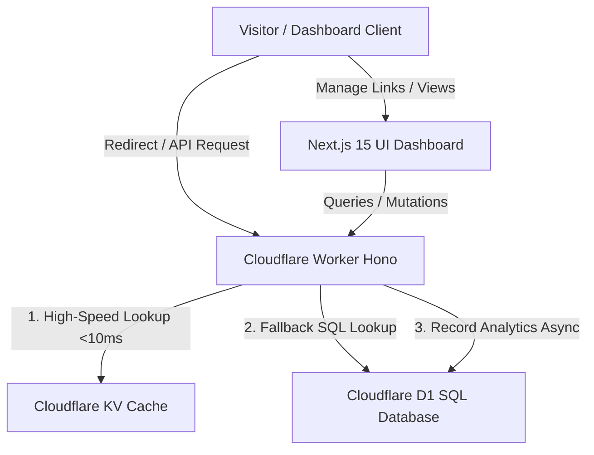

# SnapURL ⚡

> Modern, production-ready, edge-deployed URL shortener and analytics SaaS platform.

SnapURL is a full-featured, global edge-deployed URL shortening platform similar to Bitly or Dub.co. It is designed to deliver lightning-fast edge redirects (under 10ms), real-time Recharts analytics, customized QR codes, a public REST API, and a beautiful premium dashboard using modern SaaS branding.

---

## 🏗️ Architecture Overview



- **Frontend**: Next.js 15 (App Router), TypeScript, Tailwind CSS, shadcn/ui, Framer Motion, Zustand.
- **Backend / Redirects**: Cloudflare Workers, Hono, Drizzle ORM, Zod.
- **Database & Cache**: Cloudflare D1 (SQL) and Cloudflare KV (key-value edge cache).

---

## ⚡ Key Features

1. **Ultra-Fast Redirects**: Global routing returning 301/302 redirects under 10ms via KV caching.
2. **Robust Analytics**: Timeline clicks, unique visitors, device formats, browser distributions, top countries, and real-time logs.
3. **Advanced Link Rules**: Custom aliases, password-protection, expiration schedules, and active state toggles.
4. **Interactive QR Generator**: Dynamically generated high-res vector QR codes instantly downloadable as PNGs.
5. **Developer Public REST API**: API key registration, key hashing, and public endpoints (`/api/v1/shorten`).
6. **Sleek Bento Landing**: Premium dark/light themes, glassmorphism layouts, command palettes, and custom animations.
7. **Admin Dashboard**: System-wide analytical reports, link status controls, and spam list checks.

---

## 🚀 Getting Started Locally

To run the full stack locally without needing direct Cloudflare deployment immediately, we've implemented both **Cloudflare Wrangler** bindings and **fully mock client-side simulations** inside the Next.js frontend! This means you can run the dashboard with mock state instantly.

### 1. Running the Hono Backend

```bash
# Navigate to backend
cd backend

# Install dependencies
npm install

# Run backend worker locally in Wrangler emulator
npm run dev
```
*Your Worker will be available at `http://localhost:8787`.*

### 2. Running the Next.js Frontend

```bash
# Navigate to frontend
cd ../frontend

# Install dependencies
npm install

# Run the development server
npm run dev
```
*Your Dashboard will be running at `http://localhost:3000`.*

---

## 🌐 Production Deployment

### 1. Provisioning Cloudflare Services

Ensure you have the Wrangler CLI authenticated:
```bash
npx wrangler login
```

Create your D1 Database and KV Cache Namespace:
```bash
# Create D1 Database
npx wrangler d1 create snapurl-db

# Create KV Cache Namespace
npx wrangler kv:namespace create KV
```

Update your `backend/wrangler.toml` with the database ID and KV namespace ID returned by these commands.

### 2. Running Migrations

Generate and run D1 migrations to set up the Drizzle schemas:
```bash
cd backend
npm run db:generate
npm run db:migrate --local   # For local Wrangler
npm run db:migrate           # For production D1
```

### 3. Deploying Worker & Pages

**Deploy Backend Worker:**
```bash
cd backend
npm run deploy
```

**Deploy Frontend to Cloudflare Pages:**
Configure a Cloudflare Pages project pointing to your GitHub repository:
- **Build Command**: `npm run build`
- **Output Directory**: `.next` or `out` (depending on dynamic edge adapters or static exports)
- Set Environment Variables:
  - `NEXT_PUBLIC_API_URL`: Your deployed Worker API URL.
